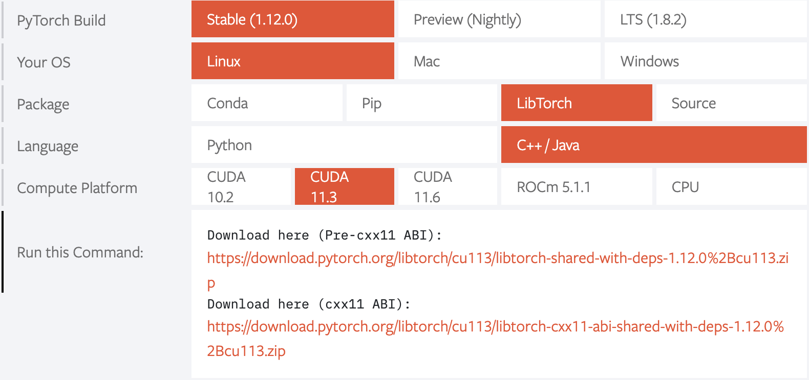

.. _build:

Building ktorch
===============

The ktorch library has been built on Linux and MacOS; it has not been tested on Windows.
(Windows is beginning to get more support with `Microsoft becoming the maintainer of the Windows version in 2020 <https://pytorch.org/blog/microsoft-becomes-maintainer-of-the-windows-version-of-pytorch/>`_.)

The first step is to `download the relevant zip file from PyTorch <https://pytorch.org/get-started/locally/>`_.
The k interface is built with the latest version of PyTorch as of Apr 2024, labeled ``Stable(2.3.0)``.

For Linux, the zip file contains all the necessary libraries and include files; there is no need to install CUDA or Intel MKL as these components are included.
The zip file is large, around 2 gigabytes for versions which include libraries for working with GPU's and around 200 megabytes for CPU-only.
Each platform has additional choices for CPU-only/GPU versions (more :ref:`here <abi>` on pre c++11 and post c++11 ABI versions).

For MacOS, the libtorch zip file distributed by PyTorch is for Apple's M1/M2/M3 chips.
It is also  possible to compile the libtorch libraries to incude a CUDA setup on Mac or use Intel CPU.
See :ref:`this section <libtorch>` on how build the PyTorch c++ libraries from source before building the k interface.

Below is a brief summary of retrieval steps for a Linux machine with Nvidia GPU(s):

Download and unzip the file for CUDA 11.8 with the pre-c++11 ABI:

::

   > wget -q https://download.pytorch.org/libtorch/cu118/libtorch-shared-with-deps-2.3.0%2Bcu118.zip
   > ls -lh libtorch-shared-with-deps-2.3.0+cu118.zip 
   -rw-rw-r-- 1 t t 2.5G Apr 23 10:12 libtorch-shared-with-deps-2.3.0+cu118.zip

   > unzip libtorch-shared-with-deps-2.3.0+cu118.zip
   Archive:  libtorch-shared-with-deps-2.3.0+cu118.zip
      creating: libtorch/
      creating: libtorch/lib/
     inflating: libtorch/lib/libasmjit.a  
     inflating: libtorch/lib/libbackend_with_compiler.so  
     inflating: libtorch/lib/libbenchmark.a  
     inflating: libtorch/lib/libbenchmark_main.a  
     inflating: libtorch/lib/libc10_cuda.so  
     ..

Download the ktorch source code via git clone:

::

   > cd ~
   > git clone https://github.com/ktorch/ktorch.git
   Cloning into 'ktorch'...

Or download as a zip file:

::

   > wget --quiet https://github.com/ktorch/ktorch/archive/refs/heads/master.zip

   > unzip master.zip
   Archive:  master.zip
      creating: ktorch-master/
     inflating: ktorch-master/LICENSE   
     inflating: ktorch-master/Makefile  
     ..

Assuming the libtorch libraries are in ~/libtorch and the ktorch source in ~/ktorch:
::

   > make

(see sample :ref:`builds <builds>` for mac :ref:`on intel <buildmac1>`, :ref:`with M1/M2 chips <buildmac2>` and :ref:`linux <buildlinux>` for more detail)

.. index:: Makefile

PyTorch zip files
*****************

The libtorch.zip files from PyTorch are saved by version: when version 2.3.0 is no longer the latest version, it is still possible to retrieve the version-specific files:

- Linux CPU
   - https://download.pytorch.org/libtorch/cpu/libtorch-shared-with-deps-2.3.0%2Bcpu.zip
   - https://download.pytorch.org/libtorch/cpu/libtorch-cxx11-abi-shared-with-deps-2.3.0%2Bcpu.zip

- Linux CUDA 11.8
   - https://download.pytorch.org/libtorch/cu118/libtorch-shared-with-deps-2.3.0%2Bcu118.zip
   - https://download.pytorch.org/libtorch/cu118/libtorch-cxx11-abi-shared-with-deps-2.3.0%2Bcu118.zip

- Linux CUDA 12.1
   - https://download.pytorch.org/libtorch/cu121/libtorch-shared-with-deps-2.3.0%2Bcu121.zip
   - https://download.pytorch.org/libtorch/cu121/libtorch-cxx11-abi-shared-with-deps-2.3.0%2Bcu121.zip

- MacOS M1/M2/M3
   - https://download.pytorch.org/libtorch/cpu/libtorch-macos-arm64-2.3.0.zip

- Release Notes
   - https://github.com/pytorch/pytorch/releases
   - https://github.com/pytorch/pytorch/releases/tag/v2.3.0

- Source
   - https://github.com/pytorch/pytorch/archive/refs/tags/v2.0.1.zip

Makefile
********

The `makefile <https://github.com/ktorch/ktorch/blob/master/Makefile>`_ can be changed to suit preferences.
There are 3 main variables, CXX, TORCH and ABI, that may need to be changed in the file itself or specified on the command line.

CXX
^^^

The c++ compiler defaults to ``clang``. To run with GCC:

::

   make CXX=g++

TORCH
^^^^^

TORCH has the location of the c++ libraries and include files for PyTorch. Default is set to ~/libtorch.

::

   make TORCH=/customdir/libtorch

.. _abi:

ABI
^^^

In Linux, there's a choice of ABI (application binary interface). Changes in the C++11 standard created
`a newer ABI <https://developers.redhat.com/blog/2015/02/05/gcc5-and-the-c11-abi/>`_.  The supplied libtorch zip files from PyTorch come in two versions,
one for the ABI prior to the changes for the C++11 standard, and one with the new ABI.

For example, for Linux, version 2.3.0, with support for CUDA 11.8, the zip files are listed as:

::

   Download here (Pre-cxx11 ABI):
   https://download.pytorch.org/libtorch/cu118/libtorch-shared-with-deps-2.3.0%2Bcu118.zip

   Download here (cxx11 ABI):
   https://download.pytorch.org/libtorch/cu118/libtorch-cxx11-abi-shared-with-deps-2.3.0%2Bcu118.zip

In their earlier versions, PyTorch only offered the older ABI with their zip files so users could maintain compatibility with older third-party libraries compiled under the old ABI, but now PyTorch offers the choice of old or new versions.
By default, the Makefile builds code with ``-D_GLIBCXX_USE_CXX11_ABI=0`` for the older API.
The Makefile variable ``ABI`` is set to 0, but can be overwritten with the command-line call ``ABI=1`` if the newer ABI zip file is used.

Source files
************

- `LICENSE <https://github.com/ktorch/ktorch/blob/master/LICENSE>`_ - MIT license
- `Makefile <https://github.com/ktorch/ktorch/blob/master/Makefile>`_
- `README.md <https://github.com/ktorch/ktorch/blob/master/README.md>`_
- `docs/ <https://github.com/ktorch/ktorch/tree/master/docs>`_ - reStructuredText files for documentation at `ktorch.readthedocs.io <https://ktorch.readthedocs.io/>`_.
- `k.h <https://github.com/ktorch/ktorch/blob/master/k.h>`_ - from Kx Systems `here <https://github.com/KxSystems/kdb/blob/master/c/c/k.h>`_.
- `ktorch.h <https://github.com/ktorch/ktorch/blob/master/ktorch.h>`_ - main header file, which, in turn includes headers from PyTorch.
- `ktorch.cpp <https://github.com/ktorch/ktorch/blob/master/ktorch.cpp>`_ - contains the code used by the rest of system dealing with tensors, modules, optimizers, etc.
- `ktensor.cpp <https://github.com/ktorch/ktorch/blob/master/ktensor.cpp>`_ - code for operating on tensors
- `kmath.cpp <https://github.com/ktorch/ktorch/blob/master/kmath.cpp>`_ - PyTorch math routines
- `knn.h <https://github.com/ktorch/ktorch/blob/master/knn.h>`_ - include k-api fns for PyTorch modules and custom module definitions
- `knn.cpp <https://github.com/ktorch/ktorch/blob/master/knn.cpp>`_ - code for building modules and sequences of modules
- `knn/ <https://github.com/ktorch/ktorch/tree/master/knn>`_ - custom modules and code to parse k args defined here
- `kloss.h <https://github.com/ktorch/ktorch/blob/master/kloss.h>`_ - redefine binary cross entropy loss functions, add smooth cross entropy
- `kloss.cpp <https://github.com/ktorch/ktorch/blob/master/kloss.cpp>`_ - code relating to loss functions and modules
- `kopt.h <https://github.com/ktorch/ktorch/blob/master/kopt.h>`_ - include custom optimizer definitions
- `kopt.cpp <https://github.com/ktorch/ktorch/blob/master/kopt.cpp>`_ - optimizer code
- `kopt/ <https://github.com/ktorch/ktorch/tree/master/kopt>`_ - custom optimizers not found in PyTorch release
- `kmodel.cpp <https://github.com/ktorch/ktorch/blob/master/kmodel.cpp>`_ - code for building models (module + optimizer + loss function)
- `ktest.cpp <https://github.com/ktorch/ktorch/blob/master/ktest.cpp>`_ - contains temporary tests, samples, etc. -- nothing essential to the interface library
- `private.h <https://github.com/ktorch/ktorch/blob/master/private.h>`_ - macros to gain access to private class elements, from `martong <https://github.com/martong/access_private>`_.
- `stb_image_write.h <https://github.com/ktorch/ktorch/blob/master/stb_image_write.h>`_ - minimal code to write .png files, from `stb <https://github.com/nothings/stb/blob/master/stb_image_write.h>`_.

.. _libtorch:

Build libtorch from source
**************************

To customize the PyTorch c++ libraries or to build to a different setup than supplied by PyTorch,
it is also possible to build the libraries from source.

For a mac with an Intel chip,
since `PyTorch no longer distributes binaries for x86_64 <https://dev-discuss.pytorch.org/t/pytorch-macos-x86-builds-deprecation-starting-january-2024/1690>`_  it's necessary to build libtorch from source.

Installing some prerequisites for macOS:

::

   brew install cmake
   pip install pyyaml

Then download the source code for PyTorch as of release ``2.3.0``:

::

   > git clone -b v2.3.0 --recurse-submodule https://github.com/pytorch/pytorch.git

   > mkdir pytorch-build
   > cd pytorch-build

   > cmake -DUSE_MPS=ON -DBUILD_SHARED_LIBS:BOOL=ON -DCMAKE_BUILD_TYPE:STRING=Release -DPYTHON_EXECUTABLE:PATH=`which python3` -DCMAKE_INSTALL_PREFIX:PATH=../pytorch-install ../pytorch
   > cmake --build . --target install

Once the build completes, the libraries are in the directory: ``pytorch-install`` and can be used to build the k interface:

::

   > cd ~/ktorch
   > make TORCH=/Users/t/pytorch-install

More notes on building the PyTorch c++ libraries via ``cmake`` as well as via ``python`` are available `here <https://github.com/pytorch/pytorch/blob/master/docs/libtorch.rst>`__.

.. _builds:

Sample builds
*************

.. _buildmac1:

MacOS, Intel CPU
^^^^^^^^^^^^^^^^

First step, get the CPU-only version of libtorch ``2.2.2`` for MacOS:

::

   > cd ~
   > wget -q https://download.pytorch.org/libtorch/cpu/libtorch-macos-arm64-2.3.0.zip

   > ls -lh libtorch-macos-arm64-2.3.0.zip
   -rw-r--r--  1 t  staff    57M Apr 23 10:09 libtorch-macos-arm64-2.3.0.zip

   > rm -rf ~/libtorch  # erase any previous version

   > unzip libtorch-macos-arm64-2.3.0.zip
   Archive:  libtorch-macos-arm64-2.3.0.zip
      creating: libtorch/
      creating: libtorch/bin/
     inflating: libtorch/build-hash     
      creating: libtorch/include/
   ..

   > ls libtorch
   bin/		build-hash	build-version	include/	lib/		share/

Next, clone the ktorch repository:

::

   > rm -rf ~/ktorch # remove any previous dir named ktorch
   > git clone https://github.com/ktorch/ktorch.git
   Cloning into 'ktorch'...

Build using make:

::

   > cd ktorch

   > time make
   clang -std=c++14 -std=gnu++14 -pedantic -Wall -Wfatal-errors -fPIC -O3 -I /Users/t/libtorch/include -I /Users/t/libtorch/include/torch/csrc/api/include   -c -o ktorch.o ktorch.cpp
   clang -std=c++14 -std=gnu++14 -pedantic -Wall -Wfatal-errors -fPIC -O3 -I /Users/t/libtorch/include -I /Users/t/libtorch/include/torch/csrc/api/include   -c -o ktensor.o ktensor.cpp
   ..
   clang -o ktorch.so ktorch.o ktensor.o kmath.o knn.o kloss.o kopt.o kmodel.o ktest.o knn/act.o knn/attention.o knn/callback.o knn/conv.o knn/distance.o knn/drop.o knn/embed.o knn/fns.o knn/fold.o knn/fork.o knn/linear.o knn/nbeats.o knn/norm.o knn/onehot.o knn/pad.o knn/recur.o knn/reshape.o knn/residual.o knn/select.o knn/seq.o knn/squeeze.o knn/transform.o knn/transformer.o knn/upsample.o knn/util.o kopt/lamb.o -undefined dynamic_lookup -shared -L/Users/t/libtorch/lib -l torch -Wl,-rpath /Users/t/libtorch/lib

   real	6m32.023s
   user	6m18.607s
   sys	0m12.748s

Faster compile (1-2 minutes) is possible with the -j option:

::

   > make -s clean
   > time make -sj

   real	1m42.412s
   user	10m11.067s
   sys	0m22.923s

   > ls -lh ./ktorch.so
   -rwxr-xr-x  1 t  staff   4.3M May 22 15:11 ktorch.so*

Check if the ``ktorch.so`` library can be loaded from within a k session:

::

   > q
   KDB+ 4.0 2022.10.26 Copyright (C) 1993-2022 Kx Systems
   m64/ 8(16)core 32768MB

   q).nn:(`ktorch 2:`fns,1)[]   / define interface functions in .nn

   q).nn.setting[]
   mkl               | 1b   /Intel's MKL libraries are available
   openmp            | 0b
   threads           | 4
   interopthreads    | 4
   mps               | 0b
   cuda              | 0b
   magma             | 0b
   cudnn             | 0b
   cudnnversion      | 0N
   cudadevices       | 0
   benchmark         | 0b
   deterministic     | 0
   cudnndeterministic| 0b
   stackframe        | 0b
   alloptions        | 1b
   complexfirst      | 1b

Checking the configuration:

::

   q).nn.config[]
   PyTorch built with:
     - GCC 4.2
     - C++ Version: 201703
     - clang 13.1.6
     - Intel(R) oneAPI Math Kernel Library Version 2022.2-Product Build 20220801 for Intel(R) 64 architecture applications
     - Intel(R) MKL-DNN v2.7.3 (Git Hash 6dbeffbae1f23cbbeae17adb7b5b13f1f37c080e)
     - LAPACK is enabled (usually provided by MKL)
     - NNPACK is enabled
     - CPU capability usage: AVX2
     - Build settings: BLAS_INFO=mkl, BUILD_TYPE=Release, CXX_COMPILER=/Applications/Xcode_13.3.1.app/Contents/Developer/Toolchains/XcodeDefault.xctoolchain/usr/bin/c++, CXX_FLAGS= -Wno-deprecated -fvisibility-inlines-hidden -Wno-deprecated-declarations -DUSE_PTHREADPOOL -DNDEBUG -DUSE_KINETO -DLIBKINETO_NOCUPTI -DLIBKINETO_NOROCTRACER -DUSE_FBGEMM -DUSE_QNNPACK -DUSE_PYTORCH_QNNPACK -DUSE_XNNPACK -DUSE_PYTORCH_METAL_EXPORT -DSYMBOLICATE_MOBILE_DEBUG_HANDLE -DUSE_COREML_DELEGATE -O2 -fPIC -Wall -Wextra -Werror=return-type -Werror=non-virtual-dtor -Werror=braced-scalar-init -Werror=range-loop-construct -Werror=bool-operation -Winconsistent-missing-override -Wnarrowing -Wno-missing-field-initializers -Wno-type-limits -Wno-array-bounds -Wno-unknown-pragmas -Wunused-local-typedefs -Wno-unused-parameter -Wno-unused-function -Wno-unused-result -Wno-strict-overflow -Wno-strict-aliasing -Wno-error=deprecated-declarations -Wvla-extension -Wno-range-loop-analysis -Wno-pass-failed -Wsuggest-override -Wno-error=pedantic -Wno-error=redundant-decls -Wno-error=old-style-cast -Wconstant-conversion -Wno-invalid-partial-specialization -Wno-typedef-redefinition -Wno-unused-private-field -Wno-inconsistent-missing-override -Wno-constexpr-not-const -Wno-missing-braces -Wunused-lambda-capture -Wunused-local-typedef -Qunused-arguments -fcolor-diagnostics -fdiagnostics-color=always -fno-math-errno -fno-trapping-math -Werror=format -Werror=cast-function-type -DUSE_MPS -fno-objc-arc -Wno-unguarded-availability-new -Wno-unused-private-field -Wno-missing-braces -Wno-constexpr-not-const, LAPACK_INFO=mkl, PERF_WITH_AVX=1, PERF_WITH_AVX2=1, PERF_WITH_AVX512=1, TORCH_DISABLE_GPU_ASSERTS=OFF, TORCH_VERSION=2.0.1, USE_CUDA=OFF, USE_CUDNN=OFF, USE_EXCEPTION_PTR=1, USE_GFLAGS=OFF, USE_GLOG=OFF, USE_MKL=ON, USE_MKLDNN=ON, USE_MPI=OFF, USE_NCCL=OFF, USE_NNPACK=ON, USE_OPENMP=OFF, USE_ROCM=OFF, 
   
   ATen/Parallel:
	   at::get_num_threads() : 4
	   at::get_num_interop_threads() : 4
   OpenMP not found
   Intel(R) oneAPI Math Kernel Library Version 2022.2-Product Build 20220801 for Intel(R) 64 architecture applications
	   mkl_get_max_threads() : 1
   Intel(R) MKL-DNN v2.7.3 (Git Hash 6dbeffbae1f23cbbeae17adb7b5b13f1f37c080e)
   std::thread::hardware_concurrency() : 8
   Environment variables:
	   OMP_NUM_THREADS : [not set]
	   MKL_NUM_THREADS : [not set]
   ATen parallel backend: native thread pool

To make the ``ktorch.so`` library available to q sessions without specifying a path, can do something like the following:

::

   ln -s $(pwd)/ktorch.so ~/q/m64

Once the library is built, it can be tested with some examples:

::

   > cd
   > rm -rf examples
   > git clone https://github.com/ktorch/examples.git
  
   > q examples/start/spirals.q
   KDB+ 4.0 2022.10.26 Copyright (C) 1993-2022 Kx Systems
   m64/ 8(16)core 32768MB

                                        
            0       2   2 2 2 2 2          
          0 0       2 2 2 2 2 2 2 2        
        0 0     2 2 2 2 2 2 2 2 2 2 2      
      0 0 0   2 2 2 2             2 2 2    
    0 0 0     2 2 2         1       2 2 2  
    0 0 0   2 2 2 2     1 1 1         2 2  
    0 0 0   2 2 2     1 1 1 1 1 1       2 2
    0 0 0 2 2 2 2   1 1 1 1 1 1 1 1       2
    0 0 0   2 2 2   1 1 1     1 1 1 1      
    0 0 0     2 2 2 2 2 0 0     1 1 1      
    0 0 0     2 2 2 2 2 0 0     1 1 1      
      0 0 0 0   2 2 2 0 0 0 0   1 1 1      
      0 0 0 0 0 0   0 0 0 0     1 1 1      
        0 0 0 0 0 0 0 0 0       1 1 1      
            0 0 0 0 0 0 0     1 1 1 1      
                  0           1 1 1        
                            1 1 1 1        
                    1   1 1 1 1 1          
            1 1 1 1 1 1 1 1 1 1            
                  1 1 1 1 1                
   1456 1360
   Accuracy on training data: 99.93333%
   Accuracy using new sample: 99.9%

.. _buildmac2:

MacOS, M1/M2
^^^^^^^^^^^^

As of release ``2.0.1``, PyTorch does not release the c++ libraries compiled for Apple's new M1 & M2 chips.
It is necessary to :ref:`build these libraries from source <libtorch>` or link to the c++ libraries that are part of a python installation for Mac.

Once the libtorch c++ libraries are built, clone the k api repository.

::

   > cd ~
   > git clone https://github.com/ktorch/ktorch.git
   Cloning into 'ktorch'...

Assuming the libtorch c++ libraries and include files are in the default install dir, ``~/pytorch-install``:

::

   > make TORCH=/Users/t/pytorch-install
   clang -std=c++14 -std=gnu++14 -pedantic -Wall -Wfatal-errors -fPIC -O3 -I /Users/t/pytorch-install/include -I /Users/t/pytorch-install/include/torch/csrc/api/include   -c -o ktorch.o ktorch.cpp
   clang -std=c++14 -std=gnu++14 -pedantic -Wall -Wfatal-errors -fPIC -O3 -I /Users/t/pytorch-install/include -I /Users/t/pytorch-install/include/torch/csrc/api/include   -c -o ktensor.o ktensor.cpp
   ..
   clang -o ktorch.so ktorch.o ktensor.o kmath.o knn.o kloss.o kopt.o kmodel.o ktest.o knn/act.o knn/attention.o knn/callback.o knn/conv.o knn/distance.o knn/drop.o knn/embed.o knn/fns.o knn/fold.o knn/fork.o knn/linear.o knn/nbeats.o knn/norm.o knn/onehot.o knn/pad.o knn/recur.o knn/reshape.o knn/residual.o knn/select.o knn/seq.o knn/squeeze.o knn/transform.o knn/transformer.o knn/upsample.o knn/util.o kopt/lamb.o -undefined dynamic_lookup -shared -L/Users/t/pytorch-install/lib -l torch -Wl,-rpath /Users/t/pytorch-install/lib

Instead of building the libtorch c++ libraries, an alternate method is to use the libraries distributed as part of the PyTorch installation of the python interface.
For example, using the conda install from `PyTorch <https://pytorch.org/get-started/locally/>`_:

::

   > conda install pytorch torchvision torchaudio -c pytorch

After the install, search for the main library:

::

   > find ~/miniconda3/lib -name libtorch.dylib
   /Users/t/miniconda3/lib/python3.10/site-packages/torch/lib/libtorch.dylib

Using the c++ libraries and include files that were included as part of the python install via conda:

::

   > make TORCH=/Users/t/miniconda3/lib/python3.10/site-packages/torch
   clang -std=c++14 -std=gnu++14 -pedantic -Wall -Wfatal-errors -fPIC -O3 -I /Users/t/miniconda3/lib/python3.10/site-packages/torch/include -I /Users/t/miniconda3/lib/python3.10/site-packages/torch/include/torch/csrc/api/include   -c -o ktorch.o ktorch.cpp
   ..

Build time is around 2 minutes on a macbook pro with the M2 max chip; down to about 25 seconds with the parallel compilation flag, e.g. make -j ..

Using pip instead of conda:

::

   > pip3 install torch torchvision torchaudio

   > pip3 show torch|grep ^Location:
   Location: /opt/homebrew/lib/python3.11/site-packages

   > make -sj TORCH=/opt/homebrew/lib/python3.11/site-packages/torch

   > ls -lh ktorch.so
   -rwxr-xr-x  1 t  staff   4.0M May 25 08:55 ktorch.so*

   > otool -L ktorch.so
   ktorch.so:
   	ktorch.so (compatibility version 0.0.0, current version 0.0.0)
   	@rpath/libtorch.dylib (compatibility version 0.0.0, current version 0.0.0)
   	/usr/lib/libSystem.B.dylib (compatibility version 1.0.0, current version 1319.100.3)

   > otool -l ktorch.so |grep LC_RPATH -A 2
             cmd LC_RPATH
         cmdsize 72
            path /opt/homebrew/lib/python3.11/site-packages/torch/lib (offset 12)

Loading the api functions into q:

::

   q){key[x]set'get x}(`ktorch 2:`fns,1)[];  /define interface fns in root

   q)setting[]
   mkl               | 0b
   openmp            | 0b
   threads           | 12
   interopthreads    | 12
   mps               | 1b
   cuda              | 0b
   magma             | 0b
   cudnn             | 0b
   cudnnversion      | 0N
   cudadevices       | 0
   ..

   q)help`device  /display devices and initial random seed
   cpu  | 7993899427782217949
   mps  | 6228276533503624572
   mps:0| 6228276533503624572

::

   q)x:tensor(`randn; 4096 1024)
   q)y:tensor(`randn; 1024 4096)
   q)r:tensor()

   q)\ts:10 use[r]mm(x;y)
   196 1184

   q){to(x;`mps)}'[(x;y;r)];  /move to metal performance shaders

   q)\ts use[r]mm(x;y)    /first use overhead
   55 1184
   q)\ts:10 use[r]mm(x;y)
   3 1184

.. _buildlinux:

Linux, CUDA 11.7
^^^^^^^^^^^^^^^^

Build in ``/tmp``, using the libtorch zip file for Linux, version ``2.0.1``, CUDA 11.7 with the newer c++ ABI.

::

   > cd /tmp
   > rm -rf libtorch
   > wget -q https://download.pytorch.org/libtorch/cu117/libtorch-cxx11-abi-shared-with-deps-2.0.1%2Bcu117.zip

   > ls -lh libtorch-cxx11-abi-shared-with-deps-2.0.1+cu117.zip 
   -rw-rw-r-- 1 t t 1.9G May  5 09:45 libtorch-cxx11-abi-shared-with-deps-2.0.1+cu117.zip

   > unzip -q libtorch-cxx11-abi-shared-with-deps-2.0.1+cu117.zip 
   > ls libtorch
   bin/  build-hash  build-version  include/  lib/  share/

Get the ktorch repository as a zip file:

::

   > wget -q https://github.com/ktorch/ktorch/archive/refs/heads/master.zip
   > unzip -q master.zip

Build with the ABI flag set on and the TORCH location pointing to the ``/tmp/torchlib`` directory, using ``clang``, the default compiler:

::

   > cd ktorch-master

   > time make ABI=1 TORCH=/tmp/libtorch
   clang -std=c++14 -std=gnu++14 -pedantic -Wall -Wfatal-errors -fPIC -O3 -D_GLIBCXX_USE_CXX11_ABI=1 -I /tmp/libtorch/include -I /tmp/libtorch/include/torch/csrc/api/include   -c -o ktorch.o ktorch.cpp
   clang -std=c++14 -std=gnu++14 -pedantic -Wall -Wfatal-errors -fPIC -O3 -D_GLIBCXX_USE_CXX11_ABI=1 -I /tmp/libtorch/include -I /tmp/libtorch/include/torch/csrc/api/include   -c -o ktensor.o ktensor.cpp
   ..
   clang -o ktorch.so ktorch.o ktensor.o kmath.o knn.o kloss.o kopt.o kmodel.o ktest.o knn/act.o knn/attention.o knn/callback.o knn/conv.o knn/distance.o knn/drop.o knn/embed.o knn/fns.o knn/fold.o knn/fork.o knn/linear.o knn/nbeats.o knn/norm.o knn/onehot.o knn/pad.o knn/recur.o knn/reshape.o knn/residual.o knn/select.o knn/seq.o knn/squeeze.o knn/transform.o knn/transformer.o knn/upsample.o knn/util.o kopt/lamb.o -shared -L/tmp/libtorch/lib -l torch -Wl,-rpath /tmp/libtorch/lib

   real	5m55.095s
   user	5m42.950s
   sys	0m12.081s

The build can be faster with parallel compilation if ordered output isn't required:

::

   > make -s clean
   > time make -sj ABI=1 TORCH=/tmp/libtorch

   real	1m9.112s
   user	9m50.856s
   sys	0m17.043s

Load in a k session, check version and settings:

::

   > pwd
   /tmp/ktorch-master

   > ls -lh ktorch.so
   -rwxrwxr-x 1 t t 5.6M May 23 06:40 ktorch.so*
   
   > mv ktorch.so ktorchtmp.so  #avoid confusion w'any other existing ktorch.so

   > q
   KDB+ 4.0 2022.10.26 Copyright (C) 1993-2022 Kx Systems
   l64/ 12(24)core 64025MB

   q){key[x]set'x}(`ktorchtmp 2:`fns,1)[]; /define api fns in root

   q)version[]
   2.0001

   q)version()
   "2.0.1"

   q)setting[]
   mkl               | 1b
   openmp            | 1b
   threads           | 6
   interopthreads    | 6
   mps               | 0b
   cuda              | 1b
   magma             | 1b
   cudnn             | 1b
   cudnnversion      | 8500
   cudadevices       | 2
   ..

   q)config[]
   PyTorch built with:
     - GCC 9.3
     - C++ Version: 201703
     - Intel(R) oneAPI Math Kernel Library Version 2021.4-Product Build 20210904 for Intel(R) 64 architecture applications
     - Intel(R) MKL-DNN v2.7.3 (Git Hash 6dbeffbae1f23cbbeae17adb7b5b13f1f37c080e)
     - OpenMP 201511 (a.k.a. OpenMP 4.5)
     - LAPACK is enabled (usually provided by MKL)
     - NNPACK is enabled
     - CPU capability usage: AVX2
     - CUDA Runtime 11.7
     ..

Check matrix multiply on GPU if available:

::

   q)setting`cuda
   1b

   q)a:tensor(`randn;4096 1024;`cuda`double)
   q)b:tensor(`randn;1024 4096;`cuda`double)

   q)\ts r:mm(a;b)
   208 1200
   q)\ts use[r]mm(a;b)
   1 1184

   q)to(a;`cpu)  /move tensors to cpu
   q)to(b;`cpu)

   q)\ts use[r]mm(a;b)
   112 1184

   q)x:tensor a  /run q's matrix multiply
   q)y:tensor b
   q)\ts z:x$y
   3421 268501328

   q)equal(z;r)
   0b
   q)allclose(z;r)
   1b

   q)(avg;max)@\:abs raze over z-tensor r
   2.603255e-14 4.831691e-13 

Linked libraries
****************

During the link stage of the build, the path of the PyTorch libraries are added via ``-rpath`` so that the same libraries can be located at runtime.
From the above Linux build example in ``/tmp``:

::

   clang -o ktorch.so ktorch.o ktensor.o kmath.o knn.o .. kopt/lamb.o -shared -L/tmp/libtorch/lib -l torch -Wl,-rpath /tmp/libtorch/lib

   > ldd ktorchtmp.so
	linux-vdso.so.1 (0x00007ffd33fda000)
	libtorch.so => /tmp/libtorch/lib/libtorch.so (0x00007ff5a5600000)
   	..

If the location of the ``libtorch/lib`` subdirectory is changed or in a different place on the deployment machine,
then the environment variable LD_LIBRARY_PATH can be used to point to a new location for the PyTorch shared libraries.

::

   > mv /tmp/libtorch /tmp/torch

   > ldd ktorchtmp.so
	linux-vdso.so.1 (0x00007ffc48b03000)
	libtorch.so => not found
   	..

   > export LD_LIBRARY_PATH=/tmp/torch/lib

   > ldd ktorchtmp.so
	linux-vdso.so.1 (0x00007ffe67bbf000)
	libtorch.so => /tmp/torch/lib/libtorch.so (0x00007f3a14200000)
        ..

Location of ktorch.so
*********************

In most of the examples in this documentation, the k api functions in the shared library, typically named ``ktorch.so``, are loaded via ``2:`` without any path.

::

   q)(`ktorch 2:`options,1)[]  / show default options
   device  | cpu
   dtype   | float
   layout  | strided
   gradient| nograd
   pin     | unpinned
   memory  | contiguous

This will work if the ``ktorch.so`` file is placed in, for 64-bit linux, ``~/q/l64`` or ``${QHOME}/l64`` or a symbolic link is placed there to the actual location.

::

   > ls -l ~/q/l64/ktorch.so
   lrwxrwxrwx 1 t t 24 Dec  2 14:07 /home/t/q/l64/ktorch.so -> /home/t/ktorch/ktorch.so*

An alternative is to use the full path directly or via some agreed upon environment variable.

::

   > cd /tmp
   > q
   q)(`:/home/t/ktorch/ktorch 2:`options,1)[]
   device  | cpu
   dtype   | float
   ..

   q)`KTORCH setenv "/home/t/ktorch/ktorch"
   q)((`$getenv`KTORCH)2:`options,1)[]
   device  | cpu
   dtype   | float
   ..

Defining api functions in k
***************************

The api function ``fns``, when called with an empty or dummy argument, returns a dictionary of function name and code.

::

   q)(`ktorch 2:`fns,1)[]
   dv         | code
   tree       | code
   addref     | code
   free       | code
   ..

The result of this function can be assigned to a to a namespace:

::

   q).nn:(`ktorch 2:`fns,1)[]
   q)t:.nn.tensor 1 2 3
   q).nn.tensor t
   1 2 3

or defined in the root namespace:

::

   q){key[x]set'x}(`ktorch 2:`fns,1)[];
   q)t:tensor 1 2 3
   q)tensor t
   1 2 3
