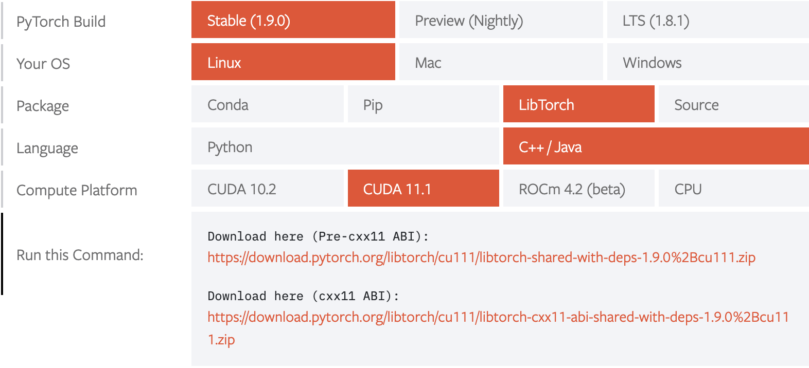

.. _build:

Building ktorch
===============

The ktorch library has been built on Linux and MacOS; it has not been tested on Windows.
(Windows is just beginning to get more support with `Microsoft becoming the maintainer of the Windows version in July 2020 <https://pytorch.org/blog/microsoft-becomes-maintainer-of-the-windows-version-of-pytorch/>`_.)

The first step is to `download the relevant zip file from PyTorch here <https://pytorch.org/get-started/locally/>`_.
The k interface requires the latest version of PyTorch, labeled ``Stable(1.8.1)``.

The zip file contains all the necessary libraries and include files; there is no need to install CUDA or Intel MKL as these components are included.
The zip file is large, around 2 gigabytes for versions which include libraries for working with GPU's and around 150 megabytes for CPU-only.
Each platform (Linux, MacOS, Windows) has additional choices for CPU-only/GPU version.

Once the zip file is downloaded and unzipped, the next step is to download the ktorch source code.

Get the code via git clone:

::

   > cd ~
   > git clone https://github.com/ktorch/ktorch.git
   Cloning into 'ktorch'...

Or download as a zip file:

::

   > wget --quiet https://github.com/ktorch/ktorch/archive/refs/heads/master.zip

   > unzip master.zip
   Archive:  master.zip
      creating: ktorch-master/
     inflating: ktorch-master/LICENSE   
     inflating: ktorch-master/Makefile  
     ..

.. index:: Makefile

Makefile
********

The `makefile <https://github.com/ktorch/ktorch/blob/master/Makefile>`_ can be changed to suit preferences.
There are 3 main variables, CXX, TORCH and ABI, that may need to be changed in the file itself or specified on the command line.

CXX
^^^

The c++ compiler defaults to ``clang++``. To run with GCC:

::

make CXX=g++

TORCH
^^^^^

TORCH has the location of the libraries for PyTorch. Default is set to ~/libtorch.

::

   make TORCH=/customdir/libtorch

It may also be possible to point the make to the libraries already installed with the python version of PyTorch.

::

   # find the dir for pytorch 1.8.1 libraries in mini conda
   find ~/miniconda3/lib  -name libtorch.so 
   /home/t/miniconda3/lib/python3.8/site-packages/torch/lib/libtorch.so

   cd ~/ktorch

   make TORCH=/home/t/miniconda3/lib/python3.8/site-packages/torch
   clang++ -std=c++14 -std=gnu++14 -pedantic -Wall -Wfatal-errors -fPIC -O3 -D_GLIBCXX_USE_CXX11_ABI=0 \
           -isystem /home/t/miniconda3/lib/python3.8/site-packages/torch/include \
           -isystem /home/t/miniconda3/lib/python3.8/site-packages/torch/include/torch/csrc/api/include \
           -c -o ktorch.o ktorch.cpp
   ..
   clang++ -o ktorch.so ktorch.o ktensor.o kmath.o knn.o kloss.o kopt.o kmodel.o ktest.o \
           -shared -L/home/t/miniconda3/lib/python3.8/site-packages/torch/lib -l torch   \
            -Wl,-rpath /home/t/miniconda3/lib/python3.8/site-packages/torch/lib

ABI
^^^

In Linux, there's a choice of ABI (application binary interface). Changes in the C++11 standard created
`a newer ABI <https://developers.redhat.com/blog/2015/02/05/gcc5-and-the-c11-abi/>`_.  The supplied libtorch zip files from PyTorch come in two versions,
one for the ABI prior to the changes for the C++11 standard, and one with the new ABI.

For example, for Linux, version 1.8.1, with support for CUDA 11.1, the zip files are listed as:

::

   Download here (Pre-cxx11 ABI):
   https://download.pytorch.org/libtorch/cu111/libtorch-shared-with-deps-1.8.1%2Bcu111.zip

   Download here (cxx11 ABI):
   https://download.pytorch.org/libtorch/cu111/libtorch-cxx11-abi-shared-with-deps-1.8.1%2Bcu111.zip

In their earlier versions, PyTorch only offered the older ABI with their zip files so users could maintain compatibility with older third-party libraries compiled under the old ABI, but now PyTorch offers the choice of old or new versions.
By default, the Makefile builds code with ``-D_GLIBCXX_USE_CXX11_ABI=0`` for the older API.
The Makefile variable ``ABI`` is set to 0, but can be overwritten with the command-line call ``ABI=1`` if the newer ABI zip file is used.

Source files
************

- `LICENSE <https://github.com/ktorch/ktorch/blob/master/LICENSE>`_ - MIT license
- `Makefile <https://github.com/ktorch/ktorch/blob/master/Makefile>`_
- `README.md <https://github.com/ktorch/ktorch/blob/master/README.md>`_
- `docs/ <https://github.com/ktorch/ktorch/tree/master/docs>`_ - reStructuredText files for documentation at `ktorch.readthedocs.io <https://ktorch.readthedocs.io/>`_.
- `k.h <https://github.com/ktorch/ktorch/blob/master/k.h>`_ - from Kx Systems `here <https://github.com/KxSystems/kdb/blob/master/c/c/k.h>`_.
- `kloss.cpp <https://github.com/ktorch/ktorch/blob/master/kloss.cpp>`_ - code relating to loss functions
- `kloss.h <https://github.com/ktorch/ktorch/blob/master/kloss.h>`_ - redefine binary cross entropy loss functions
- `kmath.cpp <https://github.com/ktorch/ktorch/blob/master/kmath.cpp>`_ - PyTorch math routines
- `kmodel.cpp <https://github.com/ktorch/ktorch/blob/master/kmodel.cpp>`_ - code for building models (module + optimizer + loss function)
- `knn.cpp <https://github.com/ktorch/ktorch/blob/master/knn.cpp>`_ - code for building modules
- `knn.h <https://github.com/ktorch/ktorch/blob/master/knn.h>`_ - custom modules defined here
- `kopt.cpp <https://github.com/ktorch/ktorch/blob/master/kopt.cpp>`_ - optimizer code
- `ktensor.cpp <https://github.com/ktorch/ktorch/blob/master/ktensor.cpp>`_ - code for operating on tensors
- `ktest.cpp <https://github.com/ktorch/ktorch/blob/master/ktest.cpp>`_ - contains temporary tests, samples, etc. -- nothing essential to the interface library
- `ktorch.cpp <https://github.com/ktorch/ktorch/blob/master/ktorch.cpp>`_ - contains the code used by the rest of system dealing with tensors, modules, optimizers, etc.
- `ktorch.h <https://github.com/ktorch/ktorch/blob/master/ktorch.h>`_ - main header file, which, in turn includes headers from PyTorch.
- `private.h <https://github.com/ktorch/ktorch/blob/master/private.h>`_ - macros to gain access to private class elements, from `here <https://github.com/martong/access_private/blob/master/include/access_private.hpp>`_.
- `stb_image_write.h <https://github.com/ktorch/ktorch/blob/master/stb_image_write.h>`_ - minimal code to write .png files, from `here <https://github.com/nothings/stb/blob/master/stb_image_write.h>`_.

Sample builds
*************

MacOS, CPU only
^^^^^^^^^^^^^^^

First step, get the CPU-only version of libtorch 1.8.1 for MacOS:

::

   > cd ~
   > wget --quiet https://download.pytorch.org/libtorch/cpu/libtorch-macos-1.8.1.zip

   > ls -lh libtorch-macos-1.8.1.zip 
   -rw-r--r--@ 1 t  staff   146M Mar 25 10:44 libtorch-macos-1.8.1.zip

   > rm -rf ~/libtorch  # erase any previous version

   > unzip libtorch-macos-1.8.1.zip 
   Archive:  libtorch-macos-1.8.1.zip
      creating: libtorch/
      creating: libtorch/bin/
     inflating: libtorch/build-hash     
      creating: libtorch/include/
   ..

   > ls libtorch
   bin/		build-hash	build-version	include/	lib/		share/

Next, clone the ktorch repository:

::

   > rm -rf ~/ktorch # remove any previous dir named ktorch
   > git clone https://github.com/ktorch/ktorch.git
   Cloning into 'ktorch'...

Build using make:

::

   > cd ktorch

   > time make CXX=g++
   g++ -std=c++14 -std=gnu++14 -pedantic -Wall -Wfatal-errors -fPIC -O3 -isystem /Users/t/libtorch/include -isystem /Users/t/libtorch/include/torch/csrc/api/include   -c -o ktorch.o ktorch.cpp
   g++ -std=c++14 -std=gnu++14 -pedantic -Wall -Wfatal-errors -fPIC -O3 -isystem /Users/t/libtorch/include -isystem /Users/t/libtorch/include/torch/csrc/api/include   -c -o ktensor.o ktensor.cpp
   g++ -std=c++14 -std=gnu++14 -pedantic -Wall -Wfatal-errors -fPIC -O3 -isystem /Users/t/libtorch/include -isystem /Users/t/libtorch/include/torch/csrc/api/include   -c -o kmath.o kmath.cpp
   g++ -std=c++14 -std=gnu++14 -pedantic -Wall -Wfatal-errors -fPIC -O3 -isystem /Users/t/libtorch/include -isystem /Users/t/libtorch/include/torch/csrc/api/include   -c -o knn.o knn.cpp
   g++ -std=c++14 -std=gnu++14 -pedantic -Wall -Wfatal-errors -fPIC -O3 -isystem /Users/t/libtorch/include -isystem /Users/t/libtorch/include/torch/csrc/api/include   -c -o kloss.o kloss.cpp
   g++ -std=c++14 -std=gnu++14 -pedantic -Wall -Wfatal-errors -fPIC -O3 -isystem /Users/t/libtorch/include -isystem /Users/t/libtorch/include/torch/csrc/api/include   -c -o kopt.o kopt.cpp
   g++ -std=c++14 -std=gnu++14 -pedantic -Wall -Wfatal-errors -fPIC -O3 -isystem /Users/t/libtorch/include -isystem /Users/t/libtorch/include/torch/csrc/api/include   -c -o kmodel.o kmodel.cpp
   g++ -std=c++14 -std=gnu++14 -pedantic -Wall -Wfatal-errors -fPIC -O3 -isystem /Users/t/libtorch/include -isystem /Users/t/libtorch/include/torch/csrc/api/include   -c -o ktest.o ktest.cpp
   g++ -o ktorch.so ktorch.o ktensor.o kmath.o knn.o kloss.o kopt.o kmodel.o ktest.o -undefined dynamic_lookup -shared -L/Users/t/libtorch/lib -l torch -Wl,-rpath /Users/t/libtorch/lib

   real	1m27.129s
   user	1m24.470s
   sys	0m2.395s

Check if the ktorch.so library can be loaded from within a k session:

::

   > q
   KDB+ 4.0 2020.05.04 Copyright (C) 1993-2020 Kx Systems
   m64/ 8(16)core 32768MB

   q).nn:(`ktorch 2:`fns,1)[]   / define interface functions in .nn

   q).nn.setting[]
   mkl               | 1b     /MKL is available
   openmp            | 0b     /no OpenMP detected -- will need to install OpenMP/clang 
   threads           | 1
   interopthreads    | 1
   cuda              | 0b     /no GPU libraries with CPU-only libtorch
   magma             | 0b
   cudnn             | 0b
   cudnnversion      | 0N
   cudadevices       | 0
   benchmark         | 0b
   deterministic     | 0b
   cudnndeterministic| 0b
   stackframe        | 0b
   alloptions        | 1b
   complexfirst      | 1b

Linux, CUDA 11.1
^^^^^^^^^^^^^^^^

Build in ``/tmp``, using the libtorch zip file for linux, version 1.8.1, CUDA 11.1 with new c++ ABI.

::

   > cd /tmp
   > wget --quiet https://download.pytorch.org/libtorch/cu111/libtorch-cxx11-abi-shared-with-deps-1.8.1%2Bcu111.zip

   > ls -lh libtorch-cxx11-abi-shared-with-deps-1.8.1+cu111.zip 
   -rw-rw-r-- 1 t t 2.0G Mar 25 10:46 libtorch-cxx11-abi-shared-with-deps-1.8.1+cu111.zip

   > unzip libtorch-cxx11-abi-shared-with-deps-1.8.1+cu111.zip 
   Archive:  libtorch-cxx11-abi-shared-with-deps-1.8.1+cu111.zip
      creating: libtorch/
      creating: libtorch/lib/
     inflating: libtorch/lib/libasmjit.a  
     inflating: libtorch/lib/libbenchmark.a  
     inflating: libtorch/lib/libbenchmark_main.a  
     inflating: libtorch/lib/libc10_cuda.so  
     ..

Get the ktorch repository as a zip file:

::

   > wget --quiet https://github.com/ktorch/ktorch/archive/refs/heads/master.zip

   > unzip master.zip
   Archive:  master.zip
   6fb9929f31d1c20984c9b196672f356bcae21178
      creating: ktorch-master/
     inflating: ktorch-master/LICENSE   
     inflating: ktorch-master/Makefile  
     ..

Build, with the ABI flag set on and the TORCH location pointing to the ``/tmp/torchlib`` directory:

::

   > cd ktorch-master

   > time make ABI=1 TORCH=/tmp/libtorch
   clang++ -std=c++14 -std=gnu++14 -pedantic -Wall -Wfatal-errors -fPIC -O3 -D_GLIBCXX_USE_CXX11_ABI=1 -isystem /tmp/libtorch/include -isystem /tmp/libtorch/include/torch/csrc/api/include   -c -o ktorch.o ktorch.cpp
   clang++ -std=c++14 -std=gnu++14 -pedantic -Wall -Wfatal-errors -fPIC -O3 -D_GLIBCXX_USE_CXX11_ABI=1 -isystem /tmp/libtorch/include -isystem /tmp/libtorch/include/torch/csrc/api/include   -c -o ktensor.o ktensor.cpp
   clang++ -std=c++14 -std=gnu++14 -pedantic -Wall -Wfatal-errors -fPIC -O3 -D_GLIBCXX_USE_CXX11_ABI=1 -isystem /tmp/libtorch/include -isystem /tmp/libtorch/include/torch/csrc/api/include   -c -o kmath.o kmath.cpp
   clang++ -std=c++14 -std=gnu++14 -pedantic -Wall -Wfatal-errors -fPIC -O3 -D_GLIBCXX_USE_CXX11_ABI=1 -isystem /tmp/libtorch/include -isystem /tmp/libtorch/include/torch/csrc/api/include   -c -o knn.o knn.cpp
   clang++ -std=c++14 -std=gnu++14 -pedantic -Wall -Wfatal-errors -fPIC -O3 -D_GLIBCXX_USE_CXX11_ABI=1 -isystem /tmp/libtorch/include -isystem /tmp/libtorch/include/torch/csrc/api/include   -c -o kloss.o kloss.cpp
   clang++ -std=c++14 -std=gnu++14 -pedantic -Wall -Wfatal-errors -fPIC -O3 -D_GLIBCXX_USE_CXX11_ABI=1 -isystem /tmp/libtorch/include -isystem /tmp/libtorch/include/torch/csrc/api/include   -c -o kopt.o kopt.cpp
   clang++ -std=c++14 -std=gnu++14 -pedantic -Wall -Wfatal-errors -fPIC -O3 -D_GLIBCXX_USE_CXX11_ABI=1 -isystem /tmp/libtorch/include -isystem /tmp/libtorch/include/torch/csrc/api/include   -c -o kmodel.o kmodel.cpp
   clang++ -std=c++14 -std=gnu++14 -pedantic -Wall -Wfatal-errors -fPIC -O3 -D_GLIBCXX_USE_CXX11_ABI=1 -isystem /tmp/libtorch/include -isystem /tmp/libtorch/include/torch/csrc/api/include   -c -o ktest.o ktest.cpp
   clang++ -o ktorch.so ktorch.o ktensor.o kmath.o knn.o kloss.o kopt.o kmodel.o ktest.o -shared -L/tmp/libtorch/lib -l torch -Wl,-rpath /tmp/libtorch/lib

   real	1m32.577s
   user	1m30.606s
   sys	0m1.804s

Load in a k session, check matrix multiply on GPU:

::

   > pwd
   /tmp/ktorch-master

   > mv ktorch.so ktorchABI1.so

   > q

   q){key[x]set'x}(`ktorchABI1 2:`fns,1)[];

   q)a:tensor(`randn;4096 1024;`cuda`double)
   q)b:tensor(`randn;1024 4096;`cuda`double)
   q)r:mm(a;b)

   q)(avg;max)@\:abs raze over tensor[r]-tensor[a]$tensor b
   1.847767e-14 3.836931e-13

Linked libraries
****************

During the link stage of the build, the path of the PyTorch libraries are added via ``-rpath`` so that the same libraries can be located at runtime.

::

   clang++ -o ktorch.so ktorch.o ktensor.o kmath.o knn.o kloss.o kopt.o kmodel.o ktest.o \
           -shared -L/home/t/libtorch/lib -l torch \
           -Wl,-rpath /home/t/libtorch/lib

   > ldd ktorch.so
	linux-vdso.so.1 (0x00007ffd8952d000)
	libtorch.so => /home/t/libtorch/lib/libtorch.so (0x00007efdbd422000)
	libstdc++.so.6 => /usr/lib/x86_64-linux-gnu/libstdc++.so.6 (0x00007efdbd099000)
	libm.so.6 => /lib/x86_64-linux-gnu/libm.so.6 (0x00007efdbccfb000)
	libgcc_s.so.1 => /lib/x86_64-linux-gnu/libgcc_s.so.1 (0x00007efdbcae3000)
	libc.so.6 => /lib/x86_64-linux-gnu/libc.so.6 (0x00007efdbc6f2000)
	/lib64/ld-linux-x86-64.so.2 (0x00007efdbdca7000)
	libtorch_cuda.so => /home/t/libtorch/lib/libtorch_cuda.so (0x00007efdae8db000)
	libtorch_cuda_cu.so => /home/t/libtorch/lib/libtorch_cuda_cu.so (0x00007efd5bcb6000)
	libtorch_cpu.so => /home/t/libtorch/lib/libtorch_cpu.so (0x00007efd49843000)
	libtorch_cuda_cpp.so => /home/t/libtorch/lib/libtorch_cuda_cpp.so (0x00007efcd49ea000)
	librt.so.1 => /lib/x86_64-linux-gnu/librt.so.1 (0x00007efcd47e2000)
	libdl.so.2 => /lib/x86_64-linux-gnu/libdl.so.2 (0x00007efcd45de000)
	libpthread.so.0 => /lib/x86_64-linux-gnu/libpthread.so.0 (0x00007efcd43bf000)
	libcudart-6d56b25a.so.11.0 => /home/t/libtorch/lib/libcudart-6d56b25a.so.11.0 (0x00007efcd4136000)
	libc10_cuda.so => /home/t/libtorch/lib/libc10_cuda.so (0x00007efcd3f06000)
	libnvToolsExt-24de1d56.so.1 => /home/t/libtorch/lib/libnvToolsExt-24de1d56.so.1 (0x00007efcd3cfc000)
	libc10.so => /home/t/libtorch/lib/libc10.so (0x00007efcd3a65000)
	libgomp-7c85b1e2.so.1 => /home/t/libtorch/lib/libgomp-7c85b1e2.so.1 (0x00007efcd383b000)

If the location of the ``libtorch/lib`` subdirectory is changed or in a different place on the deployment machine,
then the environment variable LD_LIBRARY_PATH can be used to point to a new location for the PyTorch shared libraries.

::

   > cd ~
   > mv libtorch libtorch.moved               # location differs from original build
   > ldd ktorch/ktorch.so                     # torch libraries not found
   	linux-vdso.so.1 (0x00007ffc2c8a0000)
   	libtorch.so => not found
   	..

   > export LD_LIBRARY_PATH=~/libtorch.moved/lib  # point to lib/ subdir of new location

   > ldd ktorch/ktorch.so
   	linux-vdso.so.1 (0x00007ffebd194000)
   	libtorch.so => /home/t/libtorch.moved/lib/libtorch.so (0x00007f657dc75000)
        ..

Location of ktorch.so
*********************

In the examples in this documentation, the k api functions in the shared library are loaded via ``2:`` without any path.

::

   q)(`ktorch 2:`options,1)[]  / show default options
   device  | cpu
   dtype   | float
   layout  | strided
   gradient| nograd
   pin     | unpinned
   memory  | contiguous

This will work if the ``ktorch.so`` file is placed in, for 64-bit linux, ``~/q/l64`` or ``${QHOME}/l64`` or a symbolic link is placed there to the build location.

::

   > ls -l ~/q/l64/ktorch.so
   lrwxrwxrwx 1 t t 24 Dec  2 14:07 /home/t/q/l64/ktorch.so -> /home/t/ktorch/ktorch.so*

An alternative is to use the full path directly or via some agreed upon environment variable.

::

   > cd /tmp
   > q
   q)(`:/home/t/ktorch/ktorch 2:`options,1)[]
   device  | cpu
   dtype   | float
   ..

   q)`KTORCH setenv "/home/t/ktorch/ktorch"
   q)((`$getenv`KTORCH)2:`options,1)[]
   device  | cpu
   dtype   | float
   ..

Defining api functions in k
***************************

The api function ``fns``, when called with an empty or dummy argument, returns a dictionary of function name and code.

::

   q)(`ktorch 2:`fns,1)[]
   dv         | code
   tree       | code
   addref     | code
   free       | code
   ..

The result of this function can be assigned to a to a namespace:

::

   q).nn:(`ktorch 2:`fns,1)[]
   q)t:.nn.tensor 1 2 3
   q).nn.tensor t
   1 2 3

or defined in the root namespace:

::

   q){key[x]set'x}(`ktorch 2:`fns,1)[];
   q)t:tensor 1 2 3
   q)tensor t
   1 2 3
