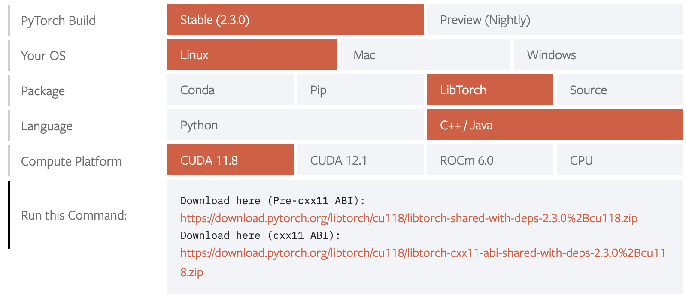

.. _build:

Building ktorch
===============

The ktorch library has been built on Linux and MacOS; it has not been tested on Windows.
(Windows is beginning to get more support with `Microsoft becoming the maintainer of the Windows version in July 2020 <https://pytorch.org/blog/microsoft-becomes-maintainer-of-the-windows-version-of-pytorch/>`_.)

The first step is to `download the relevant zip file from PyTorch <https://pytorch.org/get-started/locally/>`_.
The k interface is built with the latest version of PyTorch as of late October 2022, labeled ``Stable(1.13.0)``.

The zip file contains all the necessary libraries and include files; there is no need to install CUDA or Intel MKL as these components are included.
The zip file is large, around 2 gigabytes for versions which include libraries for working with GPU's and around 200 megabytes for CPU-only.
Each platform (Linux, MacOS, Windows) has additional choices for CPU-only/GPU version.

Once the zip file is downloaded and unzipped, the next step is to download the ktorch source code.

Get the code via git clone:

::

   > cd ~
   > git clone https://github.com/ktorch/ktorch.git
   Cloning into 'ktorch'...

Or download as a zip file:

::

   > wget --quiet https://github.com/ktorch/ktorch/archive/refs/heads/master.zip

   > unzip master.zip
   Archive:  master.zip
      creating: ktorch-master/
     inflating: ktorch-master/LICENSE   
     inflating: ktorch-master/Makefile  
     ..

(see sample :ref:`builds <builds>` for :ref:`macos <buildmac>` and :ref:`linux <buildlinux>`)

.. index:: Makefile

PyTorch zip files
*****************

The libtorch.zip files from PyTorch are saved by version: when version 1.13.0 is no longer the latest version, it is still possible to retrieve the version-specific files:

- Linux CPU
   - https://download.pytorch.org/libtorch/cpu/libtorch-shared-with-deps-1.13.0%2Bcpu.zip
   - https://download.pytorch.org/libtorch/cpu/libtorch-cxx11-abi-shared-with-deps-1.13.0%2Bcpu.zip

- Linux CUDA 11.6
   - https://download.pytorch.org/libtorch/cu116/libtorch-shared-with-deps-1.13.0%2Bcu116.zip
   - https://download.pytorch.org/libtorch/cu116/libtorch-cxx11-abi-shared-with-deps-1.13.0%2Bcu116.zip

- Linux CUDA 11.7
   - https://download.pytorch.org/libtorch/cu117/libtorch-shared-with-deps-1.13.0%2Bcu117.zip
   - https://download.pytorch.org/libtorch/cu117/libtorch-cxx11-abi-shared-with-deps-1.13.0%2Bcu117.zip

- MacOS CPU
   - https://download.pytorch.org/libtorch/cpu/libtorch-macos-1.13.0.zip

- Release Notes
   - https://github.com/pytorch/pytorch/releases
   - https://github.com/pytorch/pytorch/releases/tag/v1.13.0

- Source
   - https://github.com/pytorch/pytorch/archive/refs/tags/v1.13.0.zip

Makefile
********

The `makefile <https://github.com/ktorch/ktorch/blob/master/Makefile>`_ can be changed to suit preferences.
There are 3 main variables, CXX, TORCH and ABI, that may need to be changed in the file itself or specified on the command line.

CXX
^^^

The c++ compiler defaults to ``clang``. To run with GCC:

::

   make CXX=g++

TORCH
^^^^^

TORCH has the location of the libraries for PyTorch. Default is set to ~/libtorch.

::

   make TORCH=/customdir/libtorch

It may also be possible to build ``ktorch.so`` using libraries already installed with an existing 1.13.0 python version of PyTorch.

::

   # find the dir for pytorch 1.13.0 libraries in mini conda
   find ~/miniconda3/lib  -name libtorch.so 
   /home/t/miniconda3/lib/python3.8/site-packages/torch/lib/libtorch.so

   cd ~/ktorch

   make TORCH=/home/t/miniconda3/lib/python3.8/site-packages/torch
   clang -std=c++14 -std=gnu++14 -pedantic -Wall -Wfatal-errors -fPIC -O3 \
          -D_GLIBCXX_USE_CXX11_ABI=0 \
         -I /home/t/miniconda3/lib/python3.8/site-packages/torch/include \
         -I /home/t/miniconda3/lib/python3.8/site-packages/torch/include/torch/csrc/api/include \
         -c -o ktorch.o ktorch.cpp
   ..
   clang -o ktorch.so ktorch.o ktensor.o kmath.o knn.o kloss.o kopt.o kmodel.o ktest.o \
         knn/upsample.o knn/embed.o knn/callback.o knn/fold.o knn/norm.o knn/fork.o \
         knn/onehot.o knn/act.o knn/attention.o knn/seq.o knn/transform.o knn/recur.o \
         knn/reshape.o knn/pad.o knn/linear.o knn/squeeze.o knn/conv.o knn/drop.o \
         knn/select.o knn/nbeats.o knn/fns.o knn/residual.o knn/distance.o \
         knn/transformer.o knn/util.o kopt/lamb.o \
         -shared -L/home/t/miniconda3/lib/python3.8/site-packages/torch/lib -l torch \
         -Wl,-rpath /home/t/miniconda3/lib/python3.8/site-packages/torch/lib

ABI
^^^

In Linux, there's a choice of ABI (application binary interface). Changes in the C++11 standard created
`a newer ABI <https://developers.redhat.com/blog/2015/02/05/gcc5-and-the-c11-abi/>`_.  The supplied libtorch zip files from PyTorch come in two versions,
one for the ABI prior to the changes for the C++11 standard, and one with the new ABI.

For example, for Linux, version 1.13.0, with support for CUDA 11.6, the zip files are listed as:

::

   Download here (Pre-cxx11 ABI):
   https://download.pytorch.org/libtorch/cu116/libtorch-shared-with-deps-1.13.0%2Bcu116.zip

   Download here (cxx11 ABI):
   https://download.pytorch.org/libtorch/cu116/libtorch-cxx11-abi-shared-with-deps-1.13.0%2Bcu116.zip

In their earlier versions, PyTorch only offered the older ABI with their zip files so users could maintain compatibility with older third-party libraries compiled under the old ABI, but now PyTorch offers the choice of old or new versions.
By default, the Makefile builds code with ``-D_GLIBCXX_USE_CXX11_ABI=0`` for the older API.
The Makefile variable ``ABI`` is set to 0, but can be overwritten with the command-line call ``ABI=1`` if the newer ABI zip file is used.

Source files
************

- `LICENSE <https://github.com/ktorch/ktorch/blob/master/LICENSE>`_ - MIT license
- `Makefile <https://github.com/ktorch/ktorch/blob/master/Makefile>`_
- `README.md <https://github.com/ktorch/ktorch/blob/master/README.md>`_
- `docs/ <https://github.com/ktorch/ktorch/tree/master/docs>`_ - reStructuredText files for documentation at `ktorch.readthedocs.io <https://ktorch.readthedocs.io/>`_.
- `k.h <https://github.com/ktorch/ktorch/blob/master/k.h>`_ - from Kx Systems `here <https://github.com/KxSystems/kdb/blob/master/c/c/k.h>`_.
- `ktorch.h <https://github.com/ktorch/ktorch/blob/master/ktorch.h>`_ - main header file, which, in turn includes headers from PyTorch.
- `ktorch.cpp <https://github.com/ktorch/ktorch/blob/master/ktorch.cpp>`_ - contains the code used by the rest of system dealing with tensors, modules, optimizers, etc.
- `ktensor.cpp <https://github.com/ktorch/ktorch/blob/master/ktensor.cpp>`_ - code for operating on tensors
- `kmath.cpp <https://github.com/ktorch/ktorch/blob/master/kmath.cpp>`_ - PyTorch math routines
- `knn.h <https://github.com/ktorch/ktorch/blob/master/knn.h>`_ - include k-api fns for PyTorch modules and custom module definitions
- `knn.cpp <https://github.com/ktorch/ktorch/blob/master/knn.cpp>`_ - code for building modules and sequences of modules
- `knn/ <https://github.com/ktorch/ktorch/tree/master/knn>`_ - custom modules and code to parse k args defined here
- `kloss.h <https://github.com/ktorch/ktorch/blob/master/kloss.h>`_ - redefine binary cross entropy loss functions, add smooth cross entropy
- `kloss.cpp <https://github.com/ktorch/ktorch/blob/master/kloss.cpp>`_ - code relating to loss functions and modules
- `kopt.h <https://github.com/ktorch/ktorch/blob/master/kopt.h>`_ - include custom optimizer definitions
- `kopt.cpp <https://github.com/ktorch/ktorch/blob/master/kopt.cpp>`_ - optimizer code
- `kopt/ <https://github.com/ktorch/ktorch/tree/master/kopt>`_ - custom optimizers not found in PyTorch release
- `kmodel.cpp <https://github.com/ktorch/ktorch/blob/master/kmodel.cpp>`_ - code for building models (module + optimizer + loss function)
- `ktest.cpp <https://github.com/ktorch/ktorch/blob/master/ktest.cpp>`_ - contains temporary tests, samples, etc. -- nothing essential to the interface library
- `private.h <https://github.com/ktorch/ktorch/blob/master/private.h>`_ - macros to gain access to private class elements, from `martong <https://github.com/martong/access_private>`_.
- `stb_image_write.h <https://github.com/ktorch/ktorch/blob/master/stb_image_write.h>`_ - minimal code to write .png files, from `stb <https://github.com/nothings/stb/blob/master/stb_image_write.h>`_.

.. _builds:

Sample builds
*************

.. _buildmac:

MacOS, CPU only
^^^^^^^^^^^^^^^

First step, get the CPU-only version of libtorch 1.13.0 for MacOS:

::

   > cd ~
   > wget --quiet https://download.pytorch.org/libtorch/cpu/libtorch-macos-1.13.0.zip

   > ls -lh libtorch-macos-1.13.0.zip 
   -rw-r--r--  1 t  staff   149M Oct 26 16:40 libtorch-macos-1.13.0.zip

   > rm -rf ~/libtorch  # erase any previous version

   > unzip libtorch-macos-1.13.0.zip 
   Archive:  libtorch-macos-1.13.0.zip
      creating: libtorch/
      creating: libtorch/bin/
     inflating: libtorch/build-hash     
      creating: libtorch/include/
   ..

   > ls libtorch
   bin/		build-hash	build-version	include/	lib/		share/

Next, clone the ktorch repository:

::

   > rm -rf ~/ktorch # remove any previous dir named ktorch
   > git clone https://github.com/ktorch/ktorch.git
   Cloning into 'ktorch'...

Build using make:

::

   > cd ktorch

   > time make CXX=g++
   g++ -std=c++14 -std=gnu++14 -pedantic -Wall -Wfatal-errors -fPIC -O3 -I /Users/t/libtorch/include -I /Users/t/libtorch/include/torch/csrc/api/include   -c -o ktorch.o ktorch.cpp
   g++ -std=c++14 -std=gnu++14 -pedantic -Wall -Wfatal-errors -fPIC -O3 -I /Users/t/libtorch/include -I /Users/t/libtorch/include/torch/csrc/api/include   -c -o ktensor.o ktensor.cpp
   ..
   g++ -o ktorch.so ktorch.o ktensor.o kmath.o knn.o kloss.o kopt.o kmodel.o ktest.o knn/act.o knn/attention.o knn/callback.o knn/conv.o knn/distance.o knn/drop.o knn/embed.o knn/fns.o knn/fold.o knn/fork.o knn/linear.o knn/nbeats.o knn/norm.o knn/onehot.o knn/pad.o knn/recur.o knn/reshape.o knn/residual.o knn/select.o knn/seq.o knn/squeeze.o knn/transform.o knn/transformer.o knn/upsample.o knn/util.o kopt/lamb.o -undefined dynamic_lookup -shared -L/Users/t/libtorch/lib -l torch -l torch_cpu -Wl,-rpath /Users/t/libtorch/lib

   real	7m3.792s
   user	6m31.210s
   sys	0m18.625s

Faster compile (around 1-2 minutes instead of 6-7 minutes) is possible with the -j option:

::

   > make -s clean

   > time make -sj CXX=g++

   real	1m42.412s
   user	10m11.067s
   sys	0m22.923s

   > ls -lh ./ktorch.so
   -rwxr-xr-x  1 t  staff   4.3M Oct 31 09:22 ./ktorch.so*

Check if the ``ktorch.so`` library can be loaded from within a k session:

::

   > q
   KDB+ 4.0 2021.07.12 Copyright (C) 1993-2021 Kx Systems
   m64/ 8(16)core 32768MB

   q).nn:(`ktorch 2:`fns,1)[]   / define interface functions in .nn

   q).nn.setting[]
   mkl               | 1b   /Intel's MKL libraries are available
   openmp            | 0b
   threads           | 1
   interopthreads    | 1
   cuda              | 0b   /no GPU libraries with CPU-only libtorch
   magma             | 0b
   cudnn             | 0b
   cudnnversion      | 0N
   cudadevices       | 0
   benchmark         | 0b
   deterministic     | 0
   cudnndeterministic| 0b
   stackframe        | 0b
   alloptions        | 1b
   complexfirst      | 1b

Checking the configuration:

::

   q).nn.config[]
   PyTorch built with:
     - GCC 4.2
     - C++ Version: 201402
     - clang 12.0.0
     - Intel(R) Math Kernel Library Version 2020.0.1 Product Build 20200208 for Intel(R) 64 architecture applications
     - Intel(R) MKL-DNN v2.6.0 (Git Hash 52b5f107dd9cf10910aaa19cb47f3abf9b349815)
     - LAPACK is enabled (usually provided by MKL)
     - NNPACK is enabled
     - CPU capability usage: NO AVX
     - Build settings: BLAS_INFO=mkl, BUILD_TYPE=Release, CXX_COMPILER=/Applications/Xcode_12.4.app/Contents/Developer/Toolchains/XcodeDefault.xctoolchain/usr/bin/c++, CXX_FLAGS= -Wno-deprecated -fvisibility-inlines-hidden -Wno-deprecated-declarations -DUSE_PTHREADPOOL -DNDEBUG -DUSE_KINETO -DLIBKINETO_NOCUPTI -DUSE_FBGEMM -DUSE_QNNPACK -DUSE_PYTORCH_QNNPACK -DUSE_XNNPACK -DUSE_PYTORCH_METAL_EXPORT -DSYMBOLICATE_MOBILE_DEBUG_HANDLE -DEDGE_PROFILER_USE_KINETO -DUSE_COREML_DELEGATE -O2 -fPIC -Wno-narrowing -Wall -Wextra -Werror=return-type -Werror=non-virtual-dtor -Wno-missing-field-initializers -Wno-type-limits -Wno-array-bounds -Wno-unknown-pragmas -Wunused-local-typedefs -Wno-unused-parameter -Wno-unused-function -Wno-unused-result -Wno-strict-overflow -Wno-strict-aliasing -Wno-error=deprecated-declarations -Wvla-extension -Wno-range-loop-analysis -Wno-pass-failed -Wno-error=pedantic -Wno-error=redundant-decls -Wno-error=old-style-cast -Wconstant-conversion -Wno-invalid-partial-specialization -Wno-typedef-redefinition -Wno-unused-private-field -Wno-inconsistent-missing-override -Wno-c++14-extensions -Wno-constexpr-not-const -Wno-missing-braces -Wunused-lambda-capture -Wunused-local-typedef -Qunused-arguments -fcolor-diagnostics -fdiagnostics-color=always -fno-math-errno -fno-trapping-math -Werror=format -Wno-unused-private-field -Wno-missing-braces -Wno-c++14-extensions -Wno-constexpr-not-const, LAPACK_INFO=mkl, PERF_WITH_AVX512=1, TORCH_VERSION=1.13.0, USE_CUDA=OFF, USE_CUDNN=OFF, USE_EXCEPTION_PTR=1, USE_GFLAGS=OFF, USE_GLOG=OFF, USE_MKL=ON, USE_MKLDNN=ON, USE_MPI=OFF, USE_NCCL=OFF, USE_NNPACK=ON, USE_OPENMP=OFF, USE_ROCM=OFF, 

   ATen/Parallel:
	   at::get_num_threads() : 4
	   at::get_num_interop_threads() : 4
   OpenMP not found
   Intel(R) Math Kernel Library Version 2020.0.1 Product Build 20200208 for Intel(R) 64 architecture applications
	   mkl_get_max_threads() : 1
   Intel(R) MKL-DNN v2.6.0 (Git Hash 52b5f107dd9cf10910aaa19cb47f3abf9b349815)
   std::thread::hardware_concurrency() : 8
   Environment variables:
	   OMP_NUM_THREADS : [not set]
	   MKL_NUM_THREADS : [not set]
   ATen parallel backend: native thread pool

To make the ``ktorch.so`` library available to q sessions without specifying a path, can do something like the following:

::

   ln -s $(pwd)/ktorch.so ~/q/m64

Once the library is built, it can be tested with some examples:

::

   > cd
   > rm -rf examples
   > git clone https://github.com/ktorch/examples.git
  
   > q examples/start/spirals.q
   KDB+ 4.0 2021.07.12 Copyright (C) 1993-2021 Kx Systems
   m64/ 8(16)core 32768MB

                                        
            0       2   2 2 2 2 2          
          0 0       2 2 2 2 2 2 2 2        
        0 0     2 2 2 2 2 2 2 2 2 2 2      
      0 0 0   2 2 2 2             2 2 2    
    0 0 0     2 2 2         1       2 2 2  
    0 0 0   2 2 2 2     1 1 1         2 2  
    0 0 0   2 2 2     1 1 1 1 1 1       2 2
    0 0 0 2 2 2 2   1 1 1 1 1 1 1 1       2
    0 0 0   2 2 2   1 1 1     1 1 1 1      
    0 0 0     2 2 2 2 2 0 0     1 1 1      
    0 0 0     2 2 2 2 2 0 0     1 1 1      
      0 0 0 0   2 2 2 0 0 0 0   1 1 1      
      0 0 0 0 0 0   0 0 0 0     1 1 1      
        0 0 0 0 0 0 0 0 0       1 1 1      
            0 0 0 0 0 0 0     1 1 1 1      
                  0           1 1 1        
                            1 1 1 1        
                    1   1 1 1 1 1          
            1 1 1 1 1 1 1 1 1 1            
                  1 1 1 1 1                
   683 1360
   Accuracy on training data: 99.93333%
   Accuracy using new sample: 99.9%

.. _buildlinux:

Linux, CUDA 11.6
^^^^^^^^^^^^^^^^

Build in ``/tmp``, using the libtorch zip file for linux, version 1.13.0, CUDA 11.6 with newer c++ ABI.

::

   > cd /tmp
   > rm -rf libtorch
   > wget --quiet https://download.pytorch.org/libtorch/cu116/libtorch-cxx11-abi-shared-with-deps-1.13.0%2Bcu116.zip

   > ls -lh libtorch-cxx11-abi-shared-with-deps-1.13.0+cu116.zip 
   -rw-rw-r-- 1 t t 2.0G Oct 26 16:44 libtorch-cxx11-abi-shared-with-deps-1.13.0+cu116.zip

   > unzip -q libtorch-cxx11-abi-shared-with-deps-1.13.0+cu116.zip
   > ls libtorch
   bin/  build-hash  build-version  include/  lib/  share/

Get the ktorch repository as a zip file:

::

   > wget --quiet https://github.com/ktorch/ktorch/archive/refs/heads/master.zip
   > ls -lh master.zip
   -rw-rw-r-- 1 t t 533K Oct 31 13:49 master.zip

   > unzip -l master.zip | head
   Archive:  master.zip
   74baa28a81569b1313bd20bb7bef16b60c56b358
     Length      Date    Time    Name
   ---------  ---------- -----   ----
           0  2022-10-31 09:06   ktorch-master/
        1069  2022-10-31 09:06   ktorch-master/LICENSE
        2201  2022-10-31 09:06   ktorch-master/Makefile
         467  2022-10-31 09:06   ktorch-master/README.md
           0  2022-10-31 09:06   ktorch-master/docs/
          58  2022-10-31 09:06   ktorch-master/docs/.readthedocs.yaml

   > unzip -q master.zip
   > ls ktorch-master
   docs/  k.h  kloss.cpp  kloss.h	kmath.cpp  kmodel.cpp  knn/  knn.cpp  knn.h  kopt/  kopt.cpp  kopt.h  ktensor.cpp  ktest.cpp  ktorch.cpp  ktorch.h  LICENSE  Makefile  private.h  README.md  stb_image_write.h

Build with the ABI flag set on and the TORCH location pointing to the ``/tmp/torchlib`` directory, using ``clang``, the default compiler:

::

   > cd ktorch-master

   > time make ABI=1 TORCH=/tmp/libtorch
   clang -std=c++14 -std=gnu++14 -pedantic -Wall -Wfatal-errors -fPIC -O3 -D_GLIBCXX_USE_CXX11_ABI=1 -I /tmp/libtorch/include -I /tmp/libtorch/include/torch/csrc/api/include   -c -o ktorch.o ktorch.cpp
   clang -std=c++14 -std=gnu++14 -pedantic -Wall -Wfatal-errors -fPIC -O3 -D_GLIBCXX_USE_CXX11_ABI=1 -I /tmp/libtorch/include -I /tmp/libtorch/include/torch/csrc/api/include   -c -o ktensor.o ktensor.cpp
   ..
   clang -o ktorch.so ktorch.o ktensor.o kmath.o knn.o kloss.o kopt.o kmodel.o ktest.o knn/upsample.o knn/embed.o knn/callback.o knn/fold.o knn/norm.o knn/fork.o knn/onehot.o knn/act.o knn/attention.o knn/seq.o knn/transform.o knn/recur.o knn/reshape.o knn/pad.o knn/linear.o knn/squeeze.o knn/conv.o knn/drop.o knn/select.o knn/nbeats.o knn/fns.o knn/residual.o knn/distance.o knn/transformer.o knn/util.o kopt/lamb.o -shared -L/tmp/libtorch/lib -l torch -Wl,-rpath /tmp/libtorch/lib

   real	5m9.309s
   user	4m59.954s
   sys	0m8.698s

The build can be faster with parallel compilation if ordered output isn't required:

::

   > make -s clean

   > time make -sj ABI=1 TORCH=/tmp/libtorch

   real	1m5.826s
   user	8m28.047s
   sys	0m13.033s

Load in a k session, check version and settings:

::

   > pwd
   /tmp/ktorch-master

   > ls -lh ktorch.so
   -rwxrwxr-x 1 t t 5.7M Oct 31 14:01 ktorch.so*
   
   > mv ktorch.so ktorchtmp.so  #avoid confusion w'any ktorch.so

   > q
   KDB+ 4.0 2021.07.12 Copyright (C) 1993-2021 Kx Systems
   l64/ 12(16)core 64033MB 

   q){key[x]set'x}(`ktorchtmp 2:`fns,1)[]; /define api fns in root

   q)version[]
   1.13

   q)version()
   "1.13.0"

   q)setting[]
   mkl               | 1b
   openmp            | 1b
   threads           | 6
   interopthreads    | 6
   cuda              | 1b
   magma             | 1b
   cudnn             | 1b
   cudnnversion      | 8302
   cudadevices       | 2
   ..

   q)config[]
   PyTorch built with:
     - GCC 7.5
     - C++ Version: 201402
     - Intel(R) Math Kernel Library Version 2020.0.0 Product Build 20191122 for Intel(R) 64 architecture applications
     - Intel(R) MKL-DNN v2.6.0 (Git Hash 52b5f107dd9cf10910aaa19cb47f3abf9b349815)
     - OpenMP 201511 (a.k.a. OpenMP 4.5)
     - LAPACK is enabled (usually provided by MKL)
     - NNPACK is enabled
     - CPU capability usage: AVX2
     - CUDA Runtime 11.6
     ..

Check matrix multiply on GPU if avail:

::

   q)setting`cuda
   1b

   q)a:tensor(`randn;4096 1024;`cuda`double)
   q)b:tensor(`randn;1024 4096;`cuda`double)

   q)\ts r:mm(a;b)
   208 1200
   q)\ts r:mm(a;b)
   1 1200

   q)to(a;`cpu)  /move tensors to cpu
   q)to(b;`cpu)

   q)\ts use[r]mm(a;b)
   130 1184

   q)x:tensor a  /run q's matrix multiply
   q)y:tensor b
   q)\ts z:x$y
   3421 268501328

   q)equal(z;r)
   0b
   q)allclose(z;r)
   1b

   q)(avg;max)@\:abs raze over z-tensor r
   2.603255e-14 4.831691e-13 

Linked libraries
****************

During the link stage of the build, the path of the PyTorch libraries are added via ``-rpath`` so that the same libraries can be located at runtime.
From the above Linux build example in ``/tmp``:

::

   clang -o ktorch.so ktorch.o ktensor.o kmath.o knn.o .. kopt/lamb.o -shared -L/tmp/libtorch/lib -l torch -Wl,-rpath /tmp/libtorch/lib

   > ldd ktorchtmp.so
   	linux-vdso.so.1 (0x00007ffc93564000)
   	libtorch.so => /tmp/libtorch/lib/libtorch.so (0x00007f8b44703000)
   	libgcc_s.so.1 => /lib/x86_64-linux-gnu/libgcc_s.so.1 (0x00007f8b444d1000)
   	libc.so.6 => /lib/x86_64-linux-gnu/libc.so.6 (0x00007f8b442df000)
   	/lib64/ld-linux-x86-64.so.2 (0x00007f8b44dc4000)
   	libtorch_cuda.so => /tmp/libtorch/lib/libtorch_cuda.so (0x00007f8b440dd000)
   	libtorch_cuda_cpp.so => /tmp/libtorch/lib/libtorch_cuda_cpp.so (0x00007f8b2dede000)
   	libtorch_cpu.so => /tmp/libtorch/lib/libtorch_cpu.so (0x00007f8b13d1b000)
   	libtorch_cuda_cu.so => /tmp/libtorch/lib/libtorch_cuda_cu.so (0x00007f8ae7c2b000)
   	libc10_cuda.so => /tmp/libtorch/lib/libc10_cuda.so (0x00007f8ae7930000)
   	libcudart-45da57e3.so.11.0 => /tmp/libtorch/lib/libcudart-45da57e3.so.11.0 (0x00007f8ae7688000)
   	libnvToolsExt-847d78f2.so.1 => /tmp/libtorch/lib/libnvToolsExt-847d78f2.so.1 (0x00007f8ae747d000)
   	libpthread.so.0 => /lib/x86_64-linux-gnu/libpthread.so.0 (0x00007f8ae745a000)
   	libc10.so => /tmp/libtorch/lib/libc10.so (0x00007f8ae71b9000)
   	libdl.so.2 => /lib/x86_64-linux-gnu/libdl.so.2 (0x00007f8ae71b1000)
   	librt.so.1 => /lib/x86_64-linux-gnu/librt.so.1 (0x00007f8ae71a7000)
   	libcudnn.so.8 => /tmp/libtorch/lib/libcudnn.so.8 (0x00007f8ae6f7f000)
   	libstdc++.so.6 => /usr/lib/x86_64-linux-gnu/libstdc++.so.6 (0x00007f8ae6b72000)
   	libm.so.6 => /lib/x86_64-linux-gnu/libm.so.6 (0x00007f8ae6a23000)
   	libgomp-52f2fd74.so.1 => /tmp/libtorch/lib/libgomp-52f2fd74.so.1 (0x00007f8ae67f0000)
   	libcublas-2854e16e.so.11 => /tmp/libtorch/lib/libcublas-2854e16e.so.11 (0x00007f8add06c000)
   	libcublasLt-b015978e.so.11 => /tmp/libtorch/lib/libcublasLt-b015978e.so.11 (0x00007f8ac8006000)

If the location of the ``libtorch/lib`` subdirectory is changed or in a different place on the deployment machine,
then the environment variable LD_LIBRARY_PATH can be used to point to a new location for the PyTorch shared libraries.

::

   > mv /tmp/libtorch /tmp/torch

   > ldd ktorchtmp.so
   	linux-vdso.so.1 (0x00007fff349ed000)
   	libtorch.so => not found
   	libgcc_s.so.1 => /lib/x86_64-linux-gnu/libgcc_s.so.1 (0x00007f72e6f34000)
   	libc.so.6 => /lib/x86_64-linux-gnu/libc.so.6 (0x00007f72e6d42000)
   	/lib64/ld-linux-x86-64.so.2 (0x00007f72e7625000)

   > export LD_LIBRARY_PATH=/tmp/torch/lib

   > ldd ktorchtmp.so
   	linux-vdso.so.1 (0x00007fff40dff000)
   	libtorch.so => /tmp/torch/lib/libtorch.so (0x00007f0a0a3a1000)
   	libgcc_s.so.1 => /lib/x86_64-linux-gnu/libgcc_s.so.1 (0x00007f0a0a16f000)
   	libc.so.6 => /lib/x86_64-linux-gnu/libc.so.6 (0x00007f0a09f7d000)
   	/lib64/ld-linux-x86-64.so.2 (0x00007f0a0aa62000)
   	libtorch_cuda.so => /tmp/torch/lib/libtorch_cuda.so (0x00007f0a09d7b000)
   	libtorch_cuda_cpp.so => /tmp/torch/lib/libtorch_cuda_cpp.so (0x00007f09f3b7c000)
        ..

Location of ktorch.so
*********************

In most of the examples in this documentation, the k api functions in the shared library, typically named ``ktorch.so``, are loaded via ``2:`` without any path.

::

   q)(`ktorch 2:`options,1)[]  / show default options
   device  | cpu
   dtype   | float
   layout  | strided
   gradient| nograd
   pin     | unpinned
   memory  | contiguous

This will work if the ``ktorch.so`` file is placed in, for 64-bit linux, ``~/q/l64`` or ``${QHOME}/l64`` or a symbolic link is placed there to the actual location.

::

   > ls -l ~/q/l64/ktorch.so
   lrwxrwxrwx 1 t t 24 Dec  2 14:07 /home/t/q/l64/ktorch.so -> /home/t/ktorch/ktorch.so*

An alternative is to use the full path directly or via some agreed upon environment variable.

::

   > cd /tmp
   > q
   q)(`:/home/t/ktorch/ktorch 2:`options,1)[]
   device  | cpu
   dtype   | float
   ..

   q)`KTORCH setenv "/home/t/ktorch/ktorch"
   q)((`$getenv`KTORCH)2:`options,1)[]
   device  | cpu
   dtype   | float
   ..

Defining api functions in k
***************************

The api function ``fns``, when called with an empty or dummy argument, returns a dictionary of function name and code.

::

   q)(`ktorch 2:`fns,1)[]
   dv         | code
   tree       | code
   addref     | code
   free       | code
   ..

The result of this function can be assigned to a to a namespace:

::

   q).nn:(`ktorch 2:`fns,1)[]
   q)t:.nn.tensor 1 2 3
   q).nn.tensor t
   1 2 3

or defined in the root namespace:

::

   q){key[x]set'x}(`ktorch 2:`fns,1)[];
   q)t:tensor 1 2 3
   q)tensor t
   1 2 3
